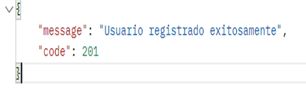
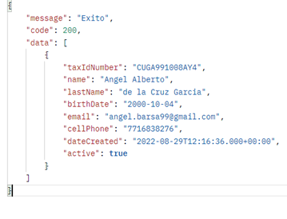
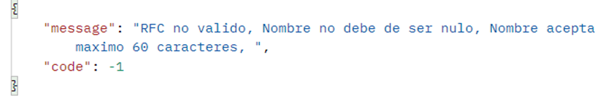
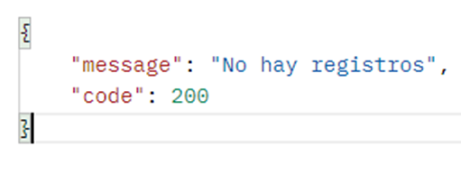

### Acerca de
El presente proyecto se desarrollo con la version 2.7.3 de Spring Boot, se crearon 6 enpoints y las dependencias utilizadas se muestras al final.
### Endpoints

1.- Listado de empleados (GET)
###### http://localhost:90/api/employee

2.- Guardar contrato (POST) no terminado
###### http://localhost:90/contract/save

###### {
    "dateFrom": "2022-08-30T02:42:10",
    "dateTo": "2023-08-28T02:42:10",
    "salaryPerDay": 200,
    "employee": 1,
    "contractType": 1
}

3.- -Crear empleado (POST)
###### http://localhost:90/api/employee/save
###### {
    "taxIdNumber": "CUGA991008AY4",
    "name": "Angel Alberto",
    "lastName": "de la Cruz Garcia",
    "birthDate": "2000-10-05",
    "email": "angel.barsa99@gmail.com",
    "cellPhone": "7716838276"
}

4.- Actualizar empleado (POST)
###### http://localhost:90/api/employee/1
###### {
    "taxIdNumber": "CUGA991008AQ7",
    "name": "Angel",
    "lastName": "Garcia",
    "birthDate": "2001-10-05",
    "email": "angel.barsa9@gmail.com",
    "cellPhone": "7716838776"
}

5.- Eliminación de contrato (DELETE)
###### http://localhost:90/api/contract/delete/1

6.- Creación de usuario con contraseña encriptada (POST)
###### http://localhost:90/api/auth/register
###### {
    "username": "btoasdasd",
    "password": "bto123"
}

Se muestra un mensaje de respuesta y el código generado de la petición:

Cuando se muestran datos se adjunta una variable llamada “data”.

Si existen errores en los datos lanzara el código -1.

Si se accede al listado de datos y no hay registros lanzara el siguiente mensaje.

##### Ejecutar el siguiente SCRIPT SQL despues de ejecutar el proyecto
##### INSERT INTO contract_types(contract_type_id, date_created, description, is_active, name)
##### VALUES (1, '2022-08-28 2:42:10', null, b'1', 'Permanent'),
##### (2, '2022-08-28 2:42:10', null, b'1', 'Fixed-Term'),
##### (3, '2022-08-28 2:42:10', null, b'1', 'External');

# Dependencias utilizadas

### Documentación

* [Official Apache Maven documentation](https://maven.apache.org/guides/index.html)
* [Spring Boot Maven Plugin Reference Guide](https://docs.spring.io/spring-boot/docs/2.7.3/maven-plugin/reference/html/)
* [Spring Boot Actuator](https://docs.spring.io/spring-boot/docs/2.7.3/reference/htmlsingle/#actuator)
* [Spring Boot DevTools](https://docs.spring.io/spring-boot/docs/2.7.3/reference/htmlsingle/#using.devtools)
* [Validation](https://docs.spring.io/spring-boot/docs/2.7.3/reference/htmlsingle/#io.validation)
* [Spring Data JPA](https://docs.spring.io/spring-boot/docs/2.7.3/reference/htmlsingle/#data.sql.jpa-and-spring-data)
* [Spring Web](https://docs.spring.io/spring-boot/docs/2.7.3/reference/htmlsingle/#web)
* [Spring Security](https://spring.io/projects/spring-security)
* [Validacion](https://spring.io/guides/gs/validating-form-input/)

